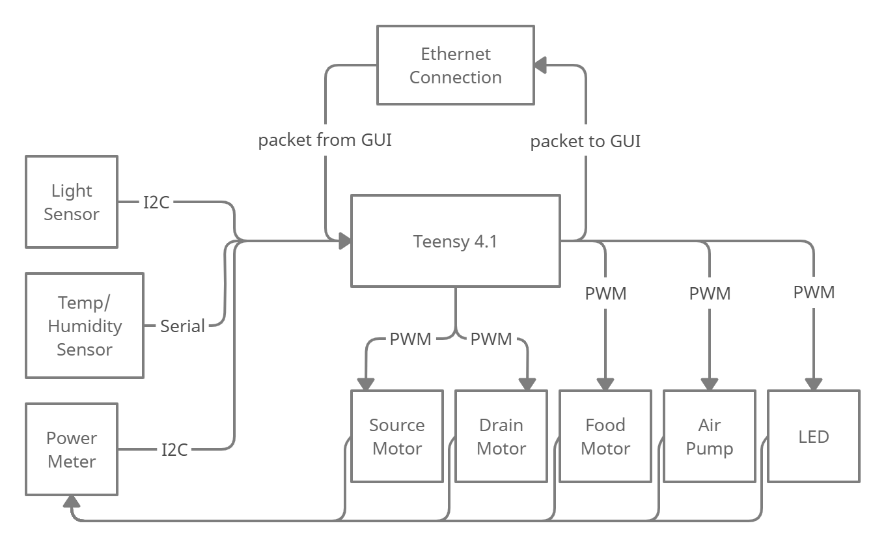
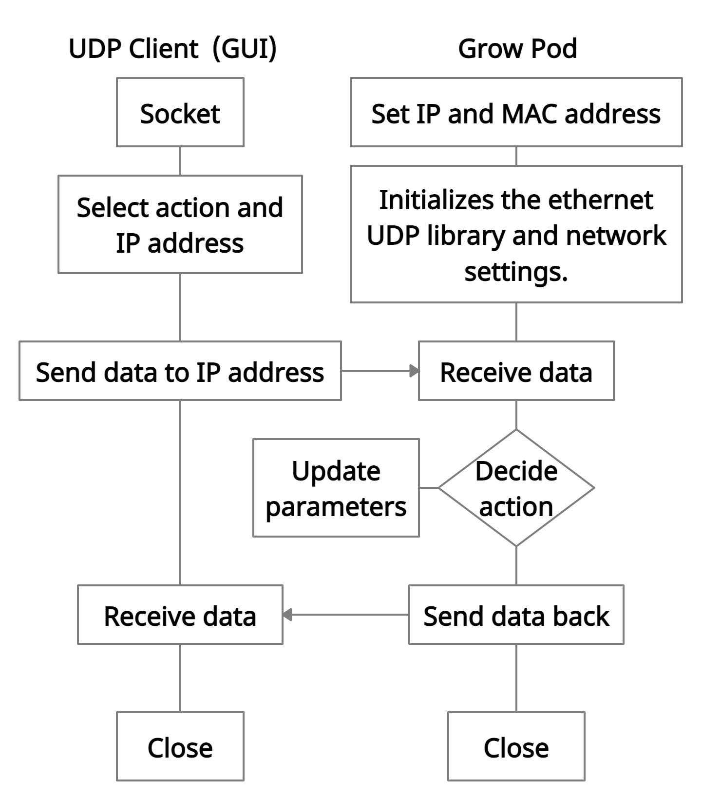
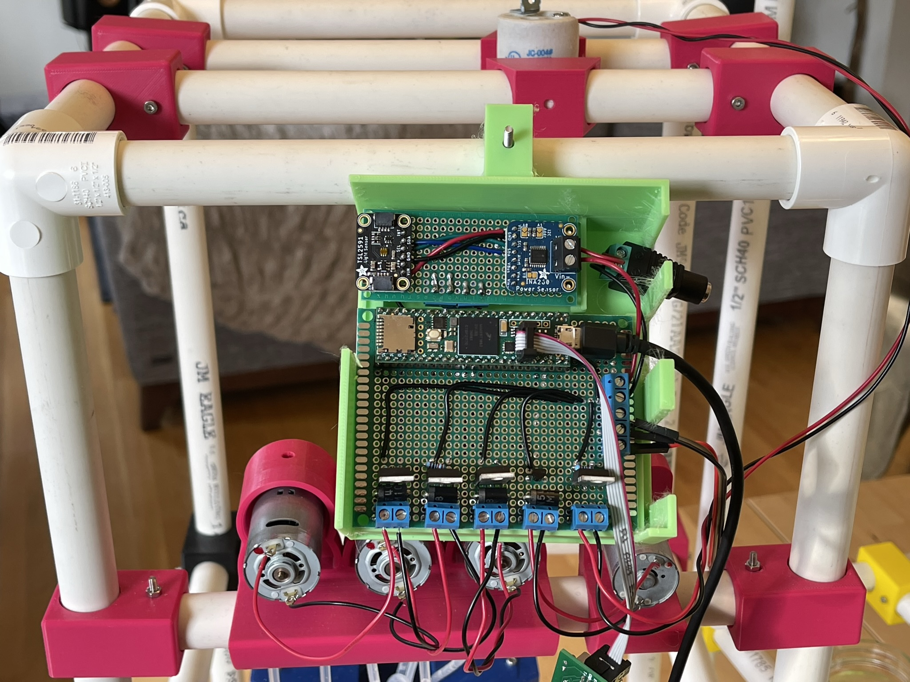
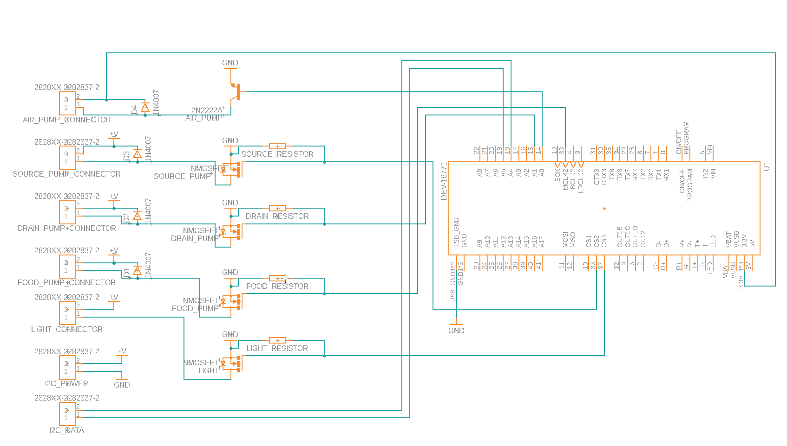

# SmartGrow: Modular Smart Hydroponics System

## Problem:  Efficient Agriculture in a Worsening Climate
How can we efficiently bring agriculture indoors, so people can easily grow their own food?

## Solution
Take hydroponics, and make it smarter, scalable, and easily approachable.

## Users
Market: Scalable from a single person, to a  building, to a community.

## Societal Impact
Make self-sufficient farm more compact and accessible for urban communities.

Decreases food-waste, transit-fuel, land-use.

## Developers

| Name           | Email           |
| -------------- | --------------- |
| Santiago Gomez | santi09@bu.edu  |
| Ben Kuter      | bmkuter@bu.edu  |
| Yuan Sui       | suiyuan@bu.edu  |

## GrowPods

Figure 1: Three Different Sized GrowPods

## GUI

Figure 2: Smart GUI to Control GrowPods

## Functional Block Diagrams

### GrowPod Embedded System

Figure 3: Block Diagram Explaining Embedded System Architecture

### UDP Communication Layer

Figure 4: Block Diagram Explaining UDP Communication Layer

## GrowPod Circuit

Figure 5: Image of GrowPod Circuit

Figure 6: Diagram of GrowPod Circuit

